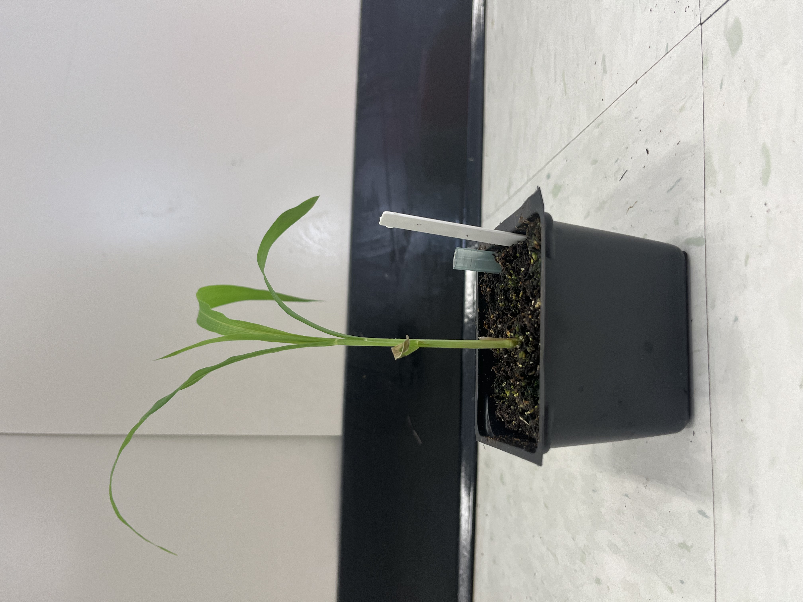

# Image Segmentation

### Installing Language Segment-Anything

By using a segmentation mask to pre-process the images, the manual process of editing background splats in the final rendered model is reduced.

Language Segment-Anything is a package used for object detection and image segmentation. To install the Language Segment-Anything model, create a new Conda environment. 

``conda create -n lang-sam``

``conda activate lang-sam``

Clone the repository and change directory into it.
```
git clone https://github.com/luca-medeiros/lang-segment-anything && cd lang-segment-anything
```
Install the package as such:
```
pip install -e.
```


## Data Preparation
The images need to be setup in a specific way so that the segmentation script can recognize it. This setup follows the same format required for COLMAP, as seen in later sections. The structure is seen below:

```
📂.../ 
├──📂gaussian-splatting/ 
│   ├──📂input_data/
│   │	├──📂plant/
│   │	│	├──📂input/
│   │	│	│	├── 🖼️ <image 0>
│   │	│	│	├── 🖼️ <image 1>
│   │	│	│	│...
│   │   │...
│   │...
│...
```
Here, the images are JPEG photos.

## Masking
Change the directory into where the images are stored, and run the script to create the masks.

```
cd C:\Users\<username>\gaussian-splatting\input_data\plant

python ..\..\create_mask.py
```
The script will utilize Language Segment-Anything to detect the plant from the rest of the image. Then, an alpha channel is applied to extract the parts of the image corresponding to the mask.

Note that the new plant foreground image is saved as a PNG, and the original in the input folder is deleted.




